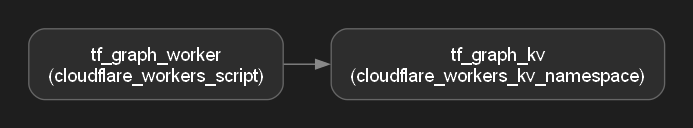

# tf-graph

A Terraform module paired with a Go CLI tool that visualizes infrastructure as a dependency graph.

## What it does

`tf-graph` reads the output of `terraform show -json` and renders your infrastructure's resources and their dependencies as a graph diagram — so you can *see* your infrastructure instead of reading through state files line by line.



The diagram above was generated directly from a real, deployed Cloudflare stack: a Worker script with a dependency on a KV namespace, exactly as captured in Terraform's own state.

## Why this exists

Most "I learned Terraform" portfolio entries are a skill badge with nothing behind them. This project pairs real infrastructure-as-code with a custom tool that consumes Terraform's own output and turns it into something a reviewer can understand in seconds — not by reading code, but by looking at a picture.

## Architecture

**Part 1 — Terraform module** (`/terraform`)
Provisions a small real Cloudflare stack on the free tier:
- A Workers KV namespace
- A Workers script bound to that namespace

No domain or paid resources required — built entirely on Cloudflare's free tier.

**Part 2 — Go CLI** (`/tf-graph-cli`)
- Parses `terraform show -json` output into Go structs
- Builds a graph data structure (nodes = resources, edges = dependencies, pulled directly from Terraform's own `depends_on` data)
- Renders the graph to Graphviz DOT format
- Shells out to Graphviz to produce a PNG

## Usage

**1. Deploy the infrastructure:**
```bash
cd terraform
terraform init
terraform apply
```

**2. Export the state as JSON:**
```bash
terraform show -json > state.json
```

**3. Build the CLI:**
```bash
cd ../tf-graph-cli
go build -o tf-graph.exe ./cmd/tf-graph
```

**4. Render the graph:**
```bash
./tf-graph.exe render --state ../terraform/state.json --out my-graph
```

This produces `my-graph.dot` and `my-graph.png` in the current folder.

### Requirements

- [Terraform](https://developer.hashicorp.com/terraform/install) >= 1.0
- [Go](https://go.dev/dl/) >= 1.21
- [Graphviz](https://graphviz.org/download/) (provides the `dot` command used for PNG rendering)
- A free [Cloudflare account](https://dash.cloudflare.com/sign-up) and API token

## Tech stack

Terraform · Go · Cloudflare (Workers, KV) · Graphviz

## License

MIT